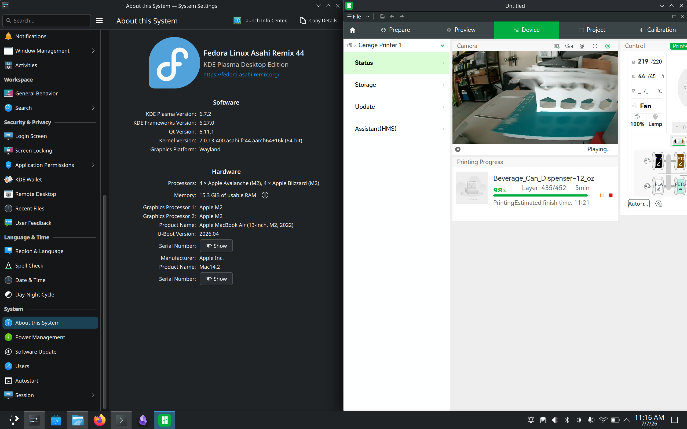

# ARM64 Bambu Network Plugin Stub

This is an experimental ARM64 replacement for Bambu Studio's
`libbambu_networking.so` on ARM64 Linux.

It exports the symbols that Bambu Studio 2.7.1.62 resolves at startup and
implements enough local/LAN behavior for an A1 in LAN mode to be discovered,
restored from config, connected over TLS MQTT, monitored through printer status
reports, uploaded over FTPS, started with a local `project_file` print command,
and viewed through local LAN liveview. Cloud account and binding flows are still
intentionally unsupported.



Build:

```sh
./build.sh
```

By default, `build.sh` expects a Bambu Studio source checkout at
`$HOME/Downloads/BambuStudio-source`. To use a different checkout:

```sh
BAMBU_STUDIO_SOURCE_DIR=/path/to/BambuStudio-source ./build.sh
```

`./build.sh` produces:

```text
build/libbambu_networking.so
build/libBambuSource.so
build/smoke-upload
build/smoke-bambu-source
build/probe-local-tunnel
```

Quick start:

1. Install Bambu Studio as a Flatpak and launch it once so its user config
   directory exists.
2. Put the printer in LAN mode and make sure this ARM device can reach the
   printer on the same network.
3. Build the ARM64 plugin binaries:

   ```sh
   ./build.sh
   ```

4. Install the rebuilt plugins into Bambu Studio's user Flatpak config:

   ```sh
   ./install-flatpak-user.sh
   ```

5. Seed or restore the LAN printer entry if Studio does not discover it
   automatically. Use the printer device id, printer LAN IP, and LAN access
   code:

   ```sh
   ./seed-lan-config.py SERIAL_OR_DEVICE_ID 192.0.2.50 ACCESS_CODE
   ```

   If discovery also needs a manual seed, write one with the same id and IP:

   ```sh
   BAMBU_DEV_ID=SERIAL_OR_DEVICE_ID BAMBU_DEV_IP=192.0.2.50 ./seed-discovered-a1-lan.sh
   ```

6. Restart Bambu Studio. The printer should appear as a LAN printer. Local
   status, FTPS upload, local print start, and LAN liveview are the intended
   working paths.

Guided install wrapper:

```sh
./guided-install.sh
```

The guided installer checks prerequisites, runs the build and export verifier,
shows BuildIDs, asks before installing into the user Flatpak config, and can
optionally seed LAN printer config with `--seed-lan`.

Install into the user Flatpak config:

```sh
./install-flatpak-user.sh
```

Verify the exported ABI symbols:

```sh
./verify-exports.sh
```

Verify the media shim load behavior:

```sh
./build/smoke-bambu-source ./build/libBambuSource.so
```

Release testing checklist:

```text
docs/testing.md
```

Collect a local, redacted diagnostic bundle for bug reports:

```sh
./collect-diagnostics.sh
```

Review the generated bundle before sharing it publicly.

Runtime diagnostics are written to:

```text
~/.var/app/com.bambulab.BambuStudio/config/BambuStudio/arm64_network_stub.log
~/.var/app/com.bambulab.BambuStudio/config/BambuStudio/arm64_bambu_source.log
```

LAN TLS peers are authenticated with first-use certificate/public-key pins
stored in:

```text
~/.var/app/com.bambulab.BambuStudio/config/BambuStudio/arm64_trusted_tls_pins.txt
```

If a printer mainboard or certificate changes, remove the matching pin entry and
reconnect on a trusted LAN.

Supported local behavior:

- LAN discovery and configured-printer restore.
- TLS MQTT status monitoring on port `8883`.
- FTPS file upload on port `990`.
- Local `project_file` print start using the uploaded 3MF.
- LAN liveview through the local port-`6000` tunnel. The implemented stream path
  matches the x86 plugin's combined `0x3000` TLS write and advertises the
  printer's MJPEG frames to Studio.
- Sleep/resume-oriented MQTT reconnect handling with direct `pushall` status
  refreshes when the selected printer is already connected.
- Lower default diagnostic overhead, with verbose hot-path logs available by
  launching Studio with `BAMBU_ARM_VERBOSE_LOG=1`.

Unsupported behavior:

- Bambu cloud login, cloud binding, and account-backed remote access.
- Agora/cloud video.
- Direct RTSP unless a printer advertises a usable `ipcam.rtsp_url`.

Known limitations:

- Tested with a Bambu Lab A1 in LAN mode on ARM64 Linux.
- First connection to each LAN TLS service must happen on a trusted LAN because
  the plugin stores a first-use certificate/public-key pin.
- If the printer certificate changes, connections will fail until the matching
  entry is removed from `arm64_trusted_tls_pins.txt`.
- The `build/smoke-upload`, `build/probe-local-tunnel`, and
  `build/official-live-probe` binaries are developer diagnostics. They are not
  intended as end-user release artifacts.
- Runtime logs are diagnostic only and intentionally avoid raw access codes,
  raw MQTT payloads, and raw discovery payloads.

License:

This project is released under the MIT License. See [LICENSE](LICENSE).

Release and security notes:

- See [CHANGELOG.md](CHANGELOG.md) for tagged release history.
- See [SECURITY.md](SECURITY.md) for supported versions, vulnerability
  reporting, and local TLS pinning guidance.
- See [docs/testing.md](docs/testing.md) for the release validation checklist.
- See [docs/guided-install-plan.md](docs/guided-install-plan.md) for the
  planned guided installer workflow.

Troubleshooting:

- If Studio does not load the plugin, run `./verify-exports.sh` and check the
  two `arm64_*` log files listed above.
- If liveview opens but stays blank, inspect `arm64_bambu_source.log` for
  `prefetch_stream_info_sample codec=mjpeg size=...`.
- If a connection fails after a printer certificate change, remove the matching
  entry from `arm64_trusted_tls_pins.txt` while on a trusted LAN.
- If upload or local print fails, inspect `arm64_network_stub.log` for the FTPS
  path and MQTT command result.
- Re-run `./install-flatpak-user.sh` after every rebuild; Bambu Studio loads the
  installed copies from its Flatpak config directory.

Optional manual LAN discovery seed file:

```text
~/.var/app/com.bambulab.BambuStudio/config/BambuStudio/arm64_discovery_devices.jsonl
```

Each non-comment line must be one full discovery JSON object:

```json
{"dev_name":"Bambu Lab A1","dev_id":"SERIAL_OR_DEVICE_ID","dev_ip":"192.0.2.50","dev_type":"N2S","dev_signal":"-50","connect_type":"lan","bind_state":"free","sec_link":"secure"}
```

For the printer discovered during Phase 2, this helper writes a LAN-mode seed:

```sh
BAMBU_DEV_ID=SERIAL_OR_DEVICE_ID BAMBU_DEV_IP=192.0.2.50 ./seed-discovered-a1-lan.sh
```

This helper writes Bambu Studio's saved LAN access state, including the encoded
`user_access_dev_ip` value required by Studio's local-printer restore path:

```sh
./seed-lan-config.py SERIAL_OR_DEVICE_ID 192.0.2.50 ACCESS_CODE
```

Current verified state:

- Bambu Studio loads the ARM64 plugin and sees the A1 over SSDP.
- `bind_detect` restores the configured device id from the seed file before
  discovery has fully started.
- TLS MQTT to the configured printer IP on port `8883` authenticates with
  `connack rc=0`.
- The plugin subscribes to `device/<device-id>/report` and receives SUBACK.
- Studio publishes `pushall` and `get_version`; the printer replies with version
  and live `push_status` JSON.
- `bambu_network_install_device_cert` emits `device_cert_installed` once per
  device so Studio's security-ready state is satisfied without log spam.
- The A1 exposes FTPS on port `990` and the newer transfer service on port
  `6000`; plain FTP port `21` is closed.
- `bambu_network_start_send_gcode_to_sdcard` now uploads the requested local file
  over FTPS using libcurl. The A1 profile's `sdcard/` folder is mapped to
  `cache/`, which is the writable FTPS directory seen on this printer.
- `build/smoke-upload` loads the plugin with `dlopen` and verifies the real
  `bambu_network_start_send_gcode_to_sdcard` export against a caller-supplied
  local file.
- `bambu_network_start_local_print_with_record` and
  `bambu_network_start_local_print` now upload the file over FTPS and publish a
  `project_file` MQTT command pointing at `file:///sdcard/cache/<file>`.
- The first live local-print test initially failed because the payload pointed
  at `Metadata/plate_2.gcode` while the uploaded 3MF contained
  `Metadata/plate_1.gcode`. The plugin now scans the 3MF and uses the embedded
  gcode path, with a fallback for Studio temp exports whose internal path uses
  a hidden `Metadata/.<temp>.gcode` name.
- Local print start has been validated with one successful full print and a
  second clean print start after the readable remote filename and gcode-param
  fixes. The printer acknowledged `project_file` with `result:"success"` and
  reported `gcode_state:"PREPARE"` followed by `gcode_state:"RUNNING"`.
- The ARM networking shim detects stale MQTT sockets after system sleep by
  sending shorter-interval MQTT pings, treats ping/publish failures as reconnect
  triggers, retries LAN MQTT reconnects with backoff, and sends `pushall` after
  reconnect so Studio refreshes printer state without needing a full restart.
- MQTT connect/reconnect workers are now owned and serialized by the agent, so
  reconnect lifecycle work is not left in detached background threads.
- `bambu_network_refresh_connection` now sends an immediate `pushall` status
  refresh when MQTT is already connected instead of forcing a reconnect. A
  reconnect is scheduled only when the active session is unusable.
- The local print path sends a status refresh after a successful `project_file`
  publish so Studio sees the printer transition sooner.
- Default logs suppress high-frequency login polling, discovery probe/candidate,
  MQTT receive/ping acknowledgement, and liveview sample-read messages. Set
  `BAMBU_ARM_VERBOSE_LOG=1` when those diagnostics are needed.
- The 3MF G-code parameter lookup now uses a single streaming scan instead of
  repeated full-file reads, while preserving plate path and Studio temp-export
  fallbacks.
- FTPS TLS pin preflight results are cached per selected-printer endpoint during
  a session, so repeated uploads do not redo the same preflight unless the
  connected endpoint changes.
- `libBambuSource.so` now exports the complete `Bambu_*` media ABI expected by
  Studio on ARM64. It creates/destroys tunnels, opens local port-6000 TLS
  liveview, advertises the printer's MJPEG stream, implements both
  `Bambu_StartStream(true)` and `Bambu_StartStreamEx(0x3000)`, and logs a
  controlled unsupported status for non-local media instead of causing Studio's
  media code to report a plugin-library/DLL load failure.
- The A1 status payload advertises an `ipcam` object with
  `ipcam_dev:"1"`, `resolution:"1080p"`, `tutk_server:"disable"`, and
  `mode_bits:3`, but it does not currently include `ipcam.liveview` or
  `ipcam.rtsp_url`. Bambu Studio's LAN video path therefore depends on the
  `bambu:///local/<ip>.?port=6000&user=bblp&passwd=<access>` local tunnel.
- `build/probe-local-tunnel` implements the currently reverse-engineered port
  6000 TLS frame protocol. It matches the x86 plugin's observed credential
  slots, random initial sequence, cipher list, and optional no-SNI behavior.
  The printer negotiates `TLSv1.2` with `ECDHE-RSA-AES256-GCM-SHA384`.
- The live-video path has now been matched more closely to the x86 control
  flow: Studio calls `Bambu_Open`, then `Bambu_StartStream(true)`, then
  `Bambu_GetStreamInfo`, then `Bambu_ReadSample`.
- The x86 plugin was inspected on a working Bambu Studio session. Its
  `BambuTunnelLocal::start(0x3000)` copies `user` into the first 32-byte slot
  and `passwd` into the second 32-byte slot before sending the 64-byte live
  control frame. A follow-up disassembly pass corrected an earlier mistaken
  `passwd`/`authkey` interpretation: the referenced string was `"user"`, not an
  authkey field. The separate non-video 16-byte auth frame uses the same
  `user`-then-`passwd` slot order.
- A follow-up disassembly pass found the critical wire-level difference:
  official `LocalTunnel_Write` sends the 16-byte `0x3000` header and 64-byte
  control payload as one contiguous `SSL_write`. Earlier ARM probes and the ARM
  shim sent header and payload as separate TLS writes; that negotiated TLS but
  produced no media frames.
- After changing `probe-local-tunnel` to send the combined 80-byte control
  record, the standalone aarch64 Flatpak probe received a media frame
  immediately. The payload starts with `ff d8 ff e0 ... AVI1`, so this printer's
  local liveview stream is JPEG/MJPEG, not H.264.
- `libBambuSource.so` now matches the combined `0x3000` write, prefetches the
  first media frame during `Bambu_GetStreamInfo`, advertises `MJPG` /
  `video_jpeg` when the first sample is JPEG, and raises `max_frame_size` from
  the old provisional 48 KB value to 1 MB. A Studio liveview test on ARM
  confirmed video playback after these changes.
- `tools/official_live_probe.cpp` can load a `libBambuSource.so` and exercise
  the local liveview ABI outside Studio. It is a developer diagnostic and reads
  the LAN access code from `BAMBU_ACCESS_CODE` so secrets are not passed on the
  command line.
- Current ARM probing through the aarch64 Flatpak runtime requires
  `--share=network`; without it, the local probe cannot connect even though the
  host can reach the printer. With network sharing enabled, port 6000 negotiates
  `TLSv1.2` / `ECDHE-RSA-AES256-GCM-SHA384`. Earlier empty/default-authkey
  control-frame probes timed out, but those probes used the now-obsolete
  `passwd`/`authkey` slot interpretation.
- The ARM `libBambuSource.so` logs only redacted local URL and credential
  metadata for liveview diagnostics.
- A follow-up x86 disassembly pass confirmed `Bambu_StartStream(true)` maps to
  `Bambu_StartStreamEx(0x3000)`. On successful local liveview start, the common
  x86 wrapper can return `Bambu_would_block` while samples are pending. Returning
  `Bambu_would_block` directly from the ARM shim's `start_local_live` caused
  Studio to repeatedly call `Bambu_StartStream(true)` and never advance to
  `Bambu_ReadSample`, so the ARM shim keeps returning `Bambu_success` from
  stream start and records concrete SSL read failure details in the sample path.
- The ARM networking shim normalizes full `push_status` payloads that
  advertise `ipcam_dev:"1"` but omit `ipcam.liveview`/`ipcam.rtsp_url`, adding
  `ipcam.liveview.local:"local"` and `remote:"none"` before handing the status
  to Studio.
- A 2026-07-07 ARM runtime smoke test confirmed liveview still returns MJPEG
  frames after first-use TLS pinning was added.
- Direct RTSP-style ports 554, 8554, 322, and 8080 were refused; port 6000 is
  the only open local-video candidate seen so far.
- `tools/official_live_probe.cpp` supports `video`, `ex`, `audio`, and
  `studio` call-order modes plus optional extra query parameters. `build.sh`
  builds it only when a host C++ compiler is installed.
- `libBambuSource.so` masks local URL host and credential query values in logs
  and treats `SSL_ERROR_ZERO_RETURN` as stream end rather than continuing to
  report "playing" with no frames.

Post-release follow-up:

- Get confirmation from another ARM64 Linux user and another LAN-mode printer.
- Keep the release source-only unless binary packaging is added intentionally;
  developer diagnostic binaries should not be shipped as end-user artifacts.
- Continue compatibility testing for readable remote filenames, 3MF metadata
  path detection, FTPS upload behavior, and sleep/resume reconnect behavior
  across Studio export paths and printer models.
- Keep cloud login, binding, Agora/cloud video, and direct RTSP unsupported
  unless a specific local-only requirement is found.
